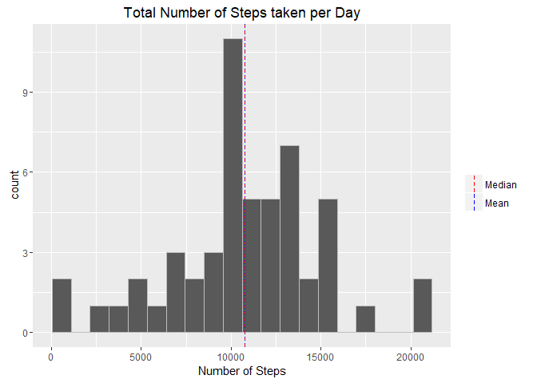
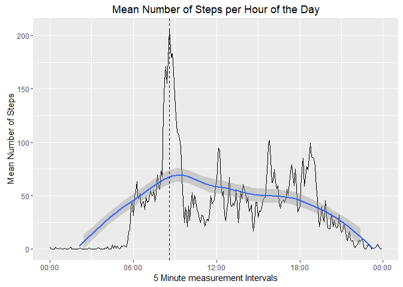
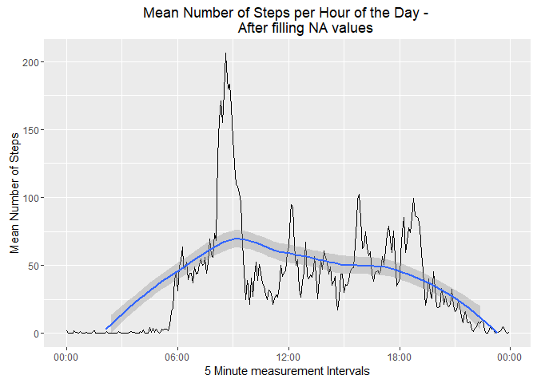
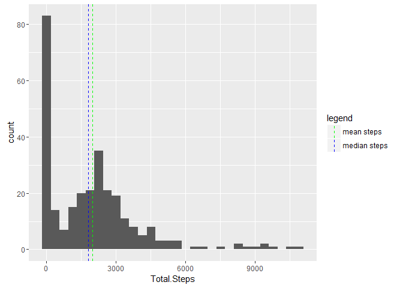
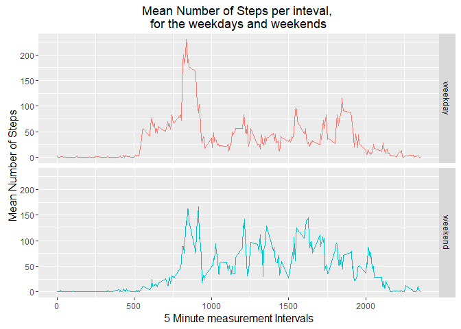

## Loading and preprocessing the data
Loading the data and getting a preview and a summary of the data.

```r
data <- read.table(unz("activity.zip", "activity.csv"), header=T, quote="\"", sep=",", na.strings = "NA")
head(data)
```

```
##   steps       date interval
## 1    NA 2012-10-01        0
## 2    NA 2012-10-01        5
## 3    NA 2012-10-01       10
## 4    NA 2012-10-01       15
## 5    NA 2012-10-01       20
## 6    NA 2012-10-01       25
```

```r
dim(data)
```

```
## [1] 17568     3
```

```r
summary(data)
```

```
##      steps                date          interval     
##  Min.   :  0.00   2012-10-01:  288   Min.   :   0.0  
##  1st Qu.:  0.00   2012-10-02:  288   1st Qu.: 588.8  
##  Median :  0.00   2012-10-03:  288   Median :1177.5  
##  Mean   : 37.38   2012-10-04:  288   Mean   :1177.5  
##  3rd Qu.: 12.00   2012-10-05:  288   3rd Qu.:1766.2  
##  Max.   :806.00   2012-10-06:  288   Max.   :2355.0  
##  NA's   :2304     (Other)   :15840
```

```r
str(data)
```

```
## 'data.frame':	17568 obs. of  3 variables:
##  $ steps   : int  NA NA NA NA NA NA NA NA NA NA ...
##  $ date    : Factor w/ 61 levels "2012-10-01","2012-10-02",..: 1 1 1 1 1 1 1 1 1 1 ...
##  $ interval: int  0 5 10 15 20 25 30 35 40 45 ...
```

The dataset has three columns, pertaining the number of steps taken, the date
in which they were taken and the time interval of the measurement.

The dataset contains 17568 measurements, 288 measurements per day (hours 
in day: 24, 5 minute intervals in hour: 12; Samples per day: 24 * 12 = 288)

Dataset contains 13.11 % of missing
values in the Steps Column.

All of the missing data is on the *steps* column, the entire first day seems 
to be missing data. 

The code below contains a investigation on the missing data. It is based on 
the assumption that the data was lost for entire days:

```r
days_with_missing_data <- table(data$date[!complete.cases(data)])
days_with_missing_data <-days_with_missing_data[days_with_missing_data!=0]
days_with_missing_data
```

```
## 
## 2012-10-01 2012-10-08 2012-11-01 2012-11-04 2012-11-09 2012-11-10 
##        288        288        288        288        288        288 
## 2012-11-14 2012-11-30 
##        288        288
```

We can now affirm that eight of the reported days have no measurements 
(288 missing values). They can thus be removed from the dataset.

```r
filtered_data <- data[complete.cases(data),]
```

Date values are defined as Factor variables, we will transform them to the
Data format.

```r
filtered_data$date <- as.Date(as.character(filtered_data$date), "%Y-%m-%d")
```

## What is mean total number of steps taken per day?

The total number of steps taken per day is shown in the histogram below:

```r
library(ggplot2)
total_steps_per_day = aggregate(filtered_data$steps, by=list(filtered_data$date), FUN= sum)
mean_of_total <- mean(total_steps_per_day$x)
median_of_total <- median(total_steps_per_day$x)
ggplot(data = total_steps_per_day, aes (total_steps_per_day$x)) +
      geom_histogram(
          col = "gray",
          breaks = seq(
            min(total_steps_per_day$x),
            max(total_steps_per_day$x),
            by= (max(total_steps_per_day$x) - min(total_steps_per_day$x))/20)
          ) + 
      geom_vline(aes(xintercept = mean_of_total, colour="blue"), lty=2) +
      geom_vline(aes(xintercept = median_of_total, colour="red"), lty=3) +
      labs(title = "Total Number of Steps taken per Day",
           x = "Number of Steps") +
     #theme(legend.position="none")
      scale_color_manual("",labels = c("Median", "Mean"), values = c("red", "blue"))
```

<!-- -->

The mean number of daily steps is 10766.19 
whereas the median number of daily steps is 
10765 (the values are very close, and
thus hard to visualize in the histogram).

## What is the average daily activity pattern?
The mean number of daily steps taken per hour of the day can be calculated as
whown below: 


```r
average_steps_per_interval = aggregate(filtered_data$steps, by=list(filtered_data$interval), FUN= mean)
names(average_steps_per_interval) <- c('Time.Interval',
                                       'Average.Steps.In.Time.Interval')
str(average_steps_per_interval)
```

```
## 'data.frame':	288 obs. of  2 variables:
##  $ Time.Interval                 : int  0 5 10 15 20 25 30 35 40 45 ...
##  $ Average.Steps.In.Time.Interval: num  1.717 0.3396 0.1321 0.1509 0.0755 ...
```

The code below transforms the *Time.Interval* column from integers to a 
time-based hour format (hh:mm).


```r
average_steps_per_interval$Time.Interval <- as.POSIXct(sprintf("%04.0f",
                              average_steps_per_interval$Time.Interval),
                      format='%H%M')
```

The graph below is a time series plot of the 5-minute interval (x-axis) and the
average number of steps taken, averaged across all days (y-axis).

A vertical line was plotted on the 5-minute interval with the maximum
average number steps, averaged across all days.

```r
peak_steps_bin <- which.max(average_steps_per_interval$Average.Steps.In.Time.Interval)
peak_steps <- average_steps_per_interval[peak_steps_bin,]

data_plot <- 
    ggplot(data = average_steps_per_interval,
           aes(x = Time.Interval,
               y = Average.Steps.In.Time.Interval)) +
    geom_line() + 
    geom_smooth() +
    geom_vline(xintercept=
        as.numeric(peak_steps$Time.Interval),
        linetype=2) +
    scale_x_datetime(labels = function(x) format(x, "%H:%M")) +
    scale_y_continuous(limits = c(0, NA)) +
    labs(title = 'Mean Number of Steps per Hour of the Day',
         x = '5 Minute measurement Intervals',
         y = 'Mean Number of Steps')

print(data_plot)
```

<!-- -->

The vertical line occured at 08:35
and the average number of steps at this interval was of
206.1698.

## Imputing missing values
As shown in the Loading and preprocessing the data, the dataset we are working
with has 2304 rows with some form of missing data.

This means that 13.11%
of the rows were excluded from the previous anayses due to some form of 
missing data.

We have also previously determined that the missing data is comprised of 
missing *steps* data from 8 distinct days:

```r
days_with_missing_data <- names(days_with_missing_data)
days_with_missing_data
```

```
## [1] "2012-10-01" "2012-10-08" "2012-11-01" "2012-11-04" "2012-11-09"
## [6] "2012-11-10" "2012-11-14" "2012-11-30"
```

A new dataset will be created in which the *steps* data from these days will
be populated with fake values. These values will be populated on an interval
basis, the input steps value shall be equal to the average step values of
that interval, using the *steps* data from the other days.


```r
average_steps_per_interval = aggregate(filtered_data$steps, by=list(filtered_data$interval), FUN= mean)
names(average_steps_per_interval) <- c('Time.Interval',
                                       'Average.Steps.In.Time.Interval')

filled_data <- data

for (row in 1:nrow(filled_data)){
        if (filled_data$date[row] %in% days_with_missing_data){
            filled_data$steps[row] <-
               average_steps_per_interval[average_steps_per_interval$Time.Interval == filled_data$interval[row],2]
        }
    }
```

Now we check if there are still any na values in the steps column, and quickly
verify if the first 288 values (previously NA) were correctly input.

```r
sum(is.na(filled_data$steps))
```

```
## [1] 0
```

```r
sum(head(filled_data$steps,288) == 
        head(average_steps_per_interval$Average.Steps.In.Time.Interval,288)) ==288
```

```
## [1] TRUE
```

Now let's re-build our plot, so we can visualize how it changed after the 
values have been input correctly.


```r
average_steps_per_interval = aggregate(filled_data$steps, by=list(filled_data$interval), FUN= mean)
names(average_steps_per_interval) <- c('Time.Interval',
                                       'Average.Steps.In.Time.Interval')
average_steps_per_interval$Time.Interval <- as.POSIXct(sprintf("%04.0f",
                              average_steps_per_interval$Time.Interval),
                      format='%H%M')

filled_data_plot <- 
    ggplot(data = average_steps_per_interval,
           aes(x = Time.Interval, 
               y = Average.Steps.In.Time.Interval)) +
    geom_line() + 
    geom_smooth() +
    scale_x_datetime(labels = function(x) format(x, "%H:%M")) +
    scale_y_continuous(limits = c(0, NA)) +
    labs(title = 'Mean Number of Steps per Hour of the Day - 
         After filling NA values',
         x = '5 Minute measurement Intervals',
         y = 'Mean Number of Steps')

print(filled_data_plot)
```

<!-- -->

```r
print(data_plot)
```

<!-- -->

As expected, there was no change whatsoever with the plots before and after
performing the change.


The next task is to make a histogram of the total number of steps taken each
day and calculate and report the mean and median total number of steps taken per day.


```r
total_steps_per_day_filled = aggregate(filled_data$steps, by=list(filled_data$interval), FUN= sum)
names(total_steps_per_day_filled) <- c('Day', 'Total.Steps')

total_steps_per_day_na = aggregate(filtered_data$steps, by=list(filtered_data$interval), FUN= sum)
names(total_steps_per_day_na) <- c('Day', 'Total.Steps')


mean_steps_filled <- mean(total_steps_per_day_filled$Total.Steps)
median_steps_filled <- median(total_steps_per_day_filled$Total.Steps)
vert_lines_filled <- data.frame(steps=c(mean_steps_filled,median_steps_filled),labels=c("mean steps","median steps"))

mean_steps_na <- mean(total_steps_per_day_na$Total.Steps)
median_steps_na <- median(total_steps_per_day_na$Total.Steps)
vert_lines_na <- data.frame(steps=c(mean_steps_na,median_steps_na),labels=c("mean steps","median steps"))

ggplot(data = total_steps_per_day_filled, aes(Total.Steps)) + geom_histogram() +
    geom_vline(aes(xintercept = steps, color=labels), data = vert_lines_filled, linetype=2) +
    scale_color_manual("legend", values=c("mean steps"="green","median steps"="blue"))
```

<!-- -->

```r
ggplot(data = total_steps_per_day_na, aes(Total.Steps)) + geom_histogram() +
    geom_vline(aes(xintercept = steps, color=labels), data = vert_lines_na, linetype=2) +
    scale_color_manual("legend", values=c("mean steps"="green","median steps"="blue"))
```

<!-- -->

In the comparisson between the plots, we see that the general distribution of
the histograms are very similar but the actual values of *Total.Steps* 
differs substantially.

This can be better observed when comparing the mean and median values of both
graphs, as shown below:


```r
data.frame("mean" = c(mean_steps_na, mean_steps_filled), "median" = c(median_steps_na, median_steps_filled),row.names = c("na","filled"))
```

```
##            mean   median
## na     1981.278 1808.000
## filled 2280.339 2080.906
```

## Are there differences in activity patterns between weekdays and weekends?

In order to identify the different activity patterns between weekdays and
weekends), we first need to be able to distinguish between the two. To do so,
we'll use the *weekdays()* function on the *date* column. The *weekdays()*
function takes as input a date value and returns the appropriate weekday.

With that in hand, we can identify weekends from weekdays using a simple if statement.

```r
filled_data$date <- as.Date(as.character(filled_data$date), "%Y-%m-%d")

filled_data['Weekend'] <- ifelse(weekdays(filled_data$date) %in% c("Saturday","Sunday"),"weekend","weekday")
```

The average steps foe each interval and wekkdays/weekend can now be calculated 
and plotted.


```r
average_steps_per_interval_per_weekday = 
    aggregate(filled_data$steps, by=list(filled_data$interval,filled_data$Weekend), FUN= mean)

names(average_steps_per_interval_per_weekday) <- c('Time.Interval','Weekday',
                                       'Average.Steps.In.Time.Interval')

ggplot(data = average_steps_per_interval_per_weekday, 
       aes(Time.Interval, Average.Steps.In.Time.Interval,col = factor(Weekday))) + 
    geom_line() +
    facet_grid(Weekday ~ .) +
    theme(legend.position="none",
          plot.title = element_text(hjust = 0.5),
          axis.title.x = element_text(size=12, face="plain"),
          axis.title.y = element_text(size=12, face="plain")) + 
    labs(title = 'Mean Number of Steps per inteval, 
for the weekdays and weekends',
         x = "5 Minute measurement Intervals",
         y = 'Mean Number of Steps') 
```

<!-- -->
